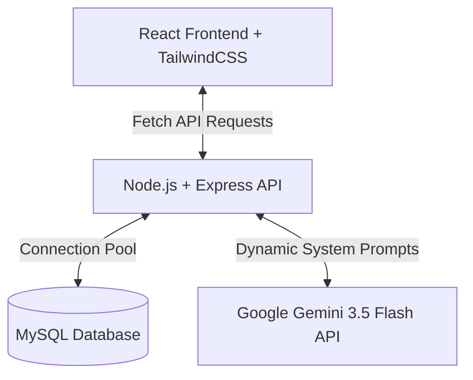

# Green Odyssey 🌍🌿
> **AI-Powered Eco-Companion & Planet Evolution Simulator**

Green Odyssey is a dynamic, gamified sustainability assistant that empowers users to learn about their carbon footprint, explore real-world environmental tradeoffs, and evolve their virtual planet from a dusty, barren rock into a thriving eco-utopia.

Built for the **Gamified Sustainability & AI Companion Assistant** vertical, Green Odyssey couples a responsive 3D-styled interactive planet canvas with specialized AI companions powered by **Google Gemini 3.5 Flash** that react dynamically to the planet's ecological health context.

---

## 🌟 Solution Vertical & Logical AI Decision-Making

### Chosen Vertical: Gamified AI Companion for Sustainability Education
Many sustainability tools rely on dry calculations and text-heavy statistics. Green Odyssey changes this by turning carbon management into an immersive planet evolution game. 

### Context-Aware AI Companion Logic
Green Odyssey features five distinct AI Companions, each representing a unique environmental sector:
1. **Moso (Panda)**: Warns about deforested areas, biodiversity loss, and agricultural choices. Speaks warmly.
2. **Bramble (Turtle)**: Slow-paced and wise. Focuses on marine health, plastic waste, and water quality.
3. **Rusty (Fox)**: Clever and energetic. Gives smart shortcuts, public transit alternatives, and smart grid hacks.
4. **Chilly (Penguin)**: Sensitive to planetary warming. Focuses on rising temperatures, glacier melting, and clean energy grids.
5. **Eco-9 (Robot)**: Highly technical and analytical. Discusses metric quantities, carbon-capture formulas, and solar configuration efficiency.

#### How It Works Under the Hood
Whenever the user chats with their companion, the client packages the current **Planet State** variables:
- **Level**: 1 to 100
- **Carbon Footprint Score**: Tons of $CO_2$ eq/year
- **Biodiversity Index**: Percentage of thriving wildlife
- **Overall Planet Health**: Water purity, land recovery
- **Citizen Happiness**: Population satisfaction index

This context is injected into a specialized dynamic **System Instruction** sent to the Gemini 3.5 Flash API. The AI companion analyzes the state in real-time, tailoring its personality, advice, and direct action tips to the exact ecological bottlenecks the user is currently facing.

---

## ⚙️ Technical Architecture



### 1. Database Schema Design (MySQL)
The application has been upgraded with a persistent database backend that replaces local browser simulation. On server startup, the database and tables are verified and initialized automatically:

*   **`users`**: Contains user accounts, logins, and settings.
    ```sql
    CREATE TABLE users (
      id VARCHAR(50) PRIMARY KEY,
      username VARCHAR(100) NOT NULL,
      email VARCHAR(150) NOT NULL UNIQUE,
      password VARCHAR(255) NOT NULL,
      avatar VARCHAR(50) NOT NULL,
      character_class VARCHAR(100) NOT NULL,
      planet_name VARCHAR(150) NOT NULL,
      joined_at VARCHAR(50) NOT NULL
    );
    ```
*   **`planet_states`**: Holds the real-time ecological parameters of each user's planet.
    ```sql
    CREATE TABLE planet_states (
      user_id VARCHAR(50) PRIMARY KEY,
      level INT NOT NULL,
      xp INT NOT NULL,
      xp_needed INT NOT NULL,
      carbon_score DOUBLE NOT NULL,
      biodiversity DOUBLE NOT NULL,
      health DOUBLE NOT NULL,
      happiness DOUBLE NOT NULL,
      air_quality DOUBLE NOT NULL,
      water_quality DOUBLE NOT NULL,
      renewable_percent DOUBLE NOT NULL,
      carbon_saved DOUBLE NOT NULL,
      eco_coins INT NOT NULL,
      gems INT NOT NULL,
      credits INT NOT NULL,
      FOREIGN KEY (user_id) REFERENCES users(id) ON DELETE CASCADE
    );
    ```
*   **`user_market_items`**: Maps purchased eco-items (wind turbines, wildflower belts, pocket forests) back to the user's planet representation.
    ```sql
    CREATE TABLE user_market_items (
      user_id VARCHAR(50),
      item_id VARCHAR(100),
      purchased_count INT NOT NULL DEFAULT 0,
      PRIMARY KEY (user_id, item_id),
      FOREIGN KEY (user_id) REFERENCES users(id) ON DELETE CASCADE
    );
    ```

### 2. State & Session Sync Pipeline
- **Session Restoration**: When the app loads, it checks if a user session is present in `localStorage`. If found, it fetches the full database state from `/api/user/state/:userId` to seamlessly restore progress.
- **Autosave Sync**: A state-change listener hook detects user accomplishments (solving quests, buying shop structures) and automatically syncs changes to `/api/user/sync` on the database without lagging the UI thread.

---

## 🎨 UI/UX & Accessibility (A11y)

- **Semantic HTML**: Fully built using HTML5 landmarks (`<header>`, `<main>`, `<section>`, `<footer >`) for logical screen reader traversal.
- **Color Systems**: Sleek, glassmorphic dark theme using high-contrast slate text panels alongside tailored, vibrant HSL status fills (Emerald, Cyan, Purple, Amber) to support readability.
- **Adaptive Design**: Modular flexbox and CSS grid layouts ensure responsiveness across desktop screens down to tablets and mobile devices.
- **Micro-Animations**: Uses transition states, gentle bounces, and slow rotation animations on the interactive canvas to keep children and learners visually engaged.

---

## 🚀 How to Run Locally

### Prerequisites
- [Node.js](https://nodejs.org/) (v18+)
- [MySQL Server 8.0+](https://dev.mysql.com/downloads/installer/)

### Setup Instructions

1.  **Clone and Install Dependencies**:
    ```bash
    git clone <your-repository-url>
    cd green-odyssey
    npm install
    ```

2.  **Configure Environment Variables**:
    Create a `.env` file in the root directory:
    ```env
    # Gemini API Key (Configure via Google AI Studio secrets if deploying)
    GEMINI_API_KEY="your-gemini-api-key-here"

    # MySQL Configuration (Default local credentials shown)
    DB_HOST="localhost"
    DB_PORT=3306
    DB_USER="root"
    DB_PASSWORD="Catherin@07"
    DB_NAME="green_odyssey"
    PORT=3000
    ```

3.  **Start the Database**:
    Ensure your local MySQL service is running. The server automatically creates the database schema on start.

4.  **Run in Development Mode**:
    ```bash
    npm run dev
    ```
    Open `http://localhost:3000` to interact with your planet!

5.  **Build and Start in Production Mode**:
    ```bash
    npm run build
    npm start
    ```

---

## 🧬 Testing & Verification

1.  **TypeScript Compilation**: Verify typescript compiles cleanly:
    ```bash
    npx tsc --noEmit
    ```
2.  **End-to-End Validation**:
    - Complete signup or sign-in on the top-right header menu.
    - Interact with challenges to earn Eco-Coins.
    - Buy shop items to place trees and structures on the interactive sandbox.
    - Refresh the browser; verify session restoration and status persistence are correctly read from MySQL tables.
